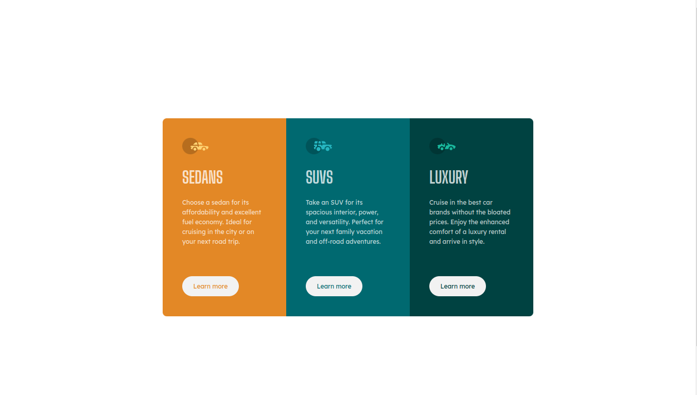

# Frontend Mentor - 3-column preview card component solution

This is a solution to the [3-column preview card component challenge on Frontend Mentor](https://www.frontendmentor.io/challenges/3column-preview-card-component-pH92eAR2-). Frontend Mentor challenges help you improve your coding skills by building realistic projects.

## Table of contents

- [Overview](#overview)
  - [The challenge](#the-challenge)
  - [Screenshot](#screenshot)
  - [Links](#links)
- [My process](#my-process)
  - [Built with](#built-with)
- [Author](#author)
- [Acknowledgments](#acknowledgments)

## Overview

### The challenge

Users should be able to:

- View the optimal layout depending on their device's screen size
- See hover states for interactive elements

### Screenshot

### Links

- Solution URL: [Add solution URL here](https://your-solution-url.com)
- [Live Site URL](https://nerometa.github.io/3-column-preview-card-component-challenge/)

## My process

I usually code my container first, then the main section of my component, then I divided it into 3 columns using Bootstrap. A lot of margin and padding classes are used to make spaces for each content.

Somehow I started with desktop first, and then use `@media` query to make it responsive.

### Built with

- HTML5
- SCSS
- Bootstrap

## Author

- Frontend Mentor - [@nerometa](https://www.frontendmentor.io/profile/nerometa)
- Github - [@nerometa](https://www.github.com/nerometa)
